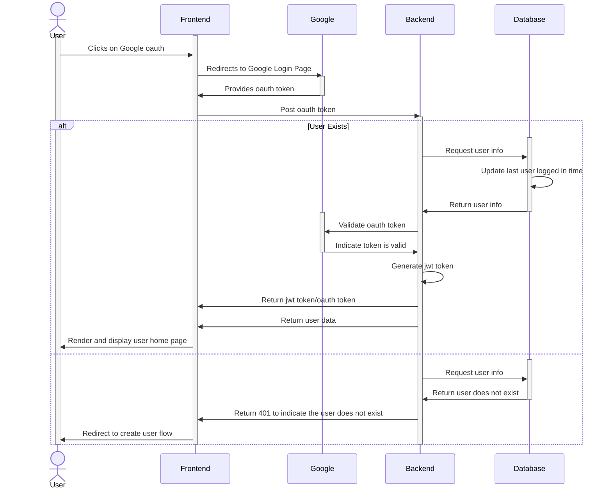
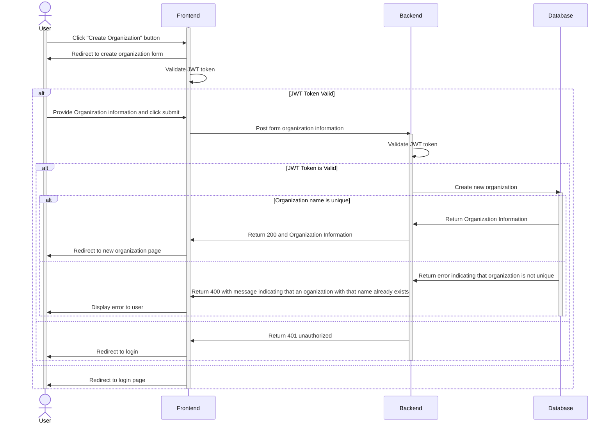
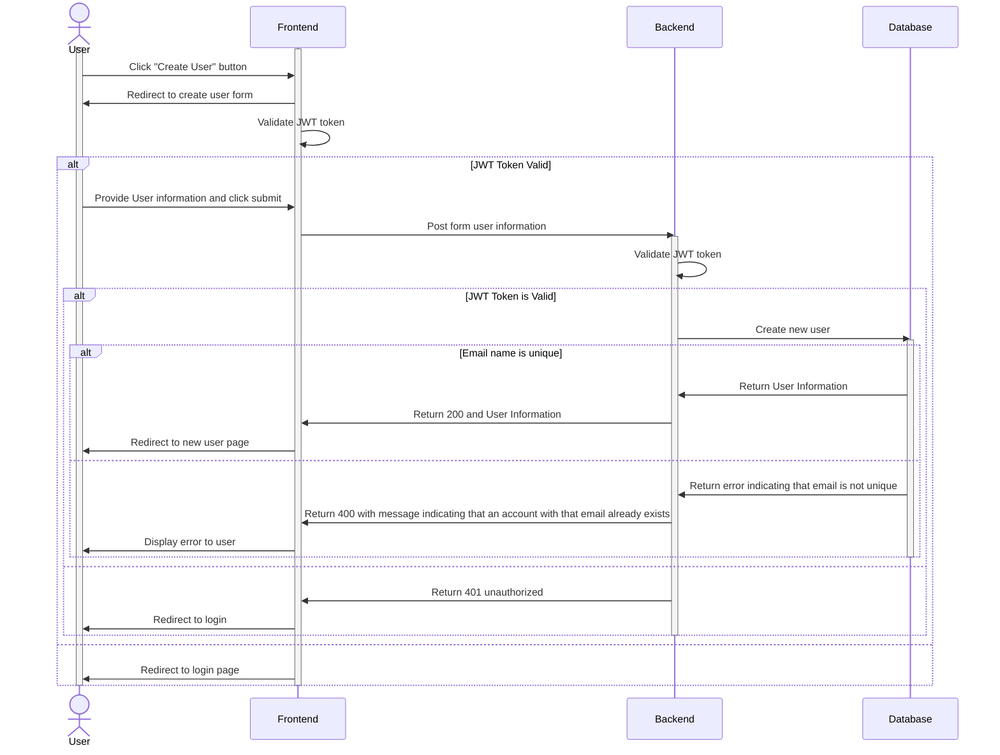

# FishSense Web App

## Login Flow

```mermaid
sequenceDiagram
    actor User

    activate User
    activate Frontend
    
    User ->> Frontend: Clicks on Google oauth
    
    Frontend ->> Google: Redirects to Google Login Page
    activate Google
    Google ->> Frontend: Provides oauth token
    deactivate Google

    Frontend ->> Backend: Post oauth token
    activate Backend
    alt User Exists

    activate Database
    Backend ->> Database: Request user info
    Database ->> Database: Update last user logged in time
    Database ->> Backend: Return user info
    deactivate Database

    activate Google
    Backend ->> Google: Validate oauth token
    Google ->> Backend: Indicate token is valid
    deactivate Google
    Backend ->> Backend: Generate jwt token
    Backend ->> Frontend: Return jwt token/oauth token
    Backend ->> Frontend: Return user data
    Frontend ->> User: Render and display user home page

    else

    activate Database
    Backend ->> Database: Request user info
    Database ->> Backend: Return user does not exist
    deactivate Database
    Backend ->> Frontend: Return 401 to indicate the user does not exist
    Frontend ->> User: Redirect to create user flow

    end

    deactivate Backend
    deactivate Frontend
    deactivate User
```

## Create Organization

```mermaid
sequenceDiagram
    actor User

    activate User
    activate Frontend

    User ->> Frontend: Click "Create Organization" button
    Frontend ->> User: Redirect to create organization form
    Frontend ->> Frontend: Validate JWT token
    alt JWT Token Valid
    User ->> Frontend: Provide Organization information and click submit
    Frontend ->> Backend: Post form organization information
    activate Backend

    Backend ->> Backend: Validate JWT token
    
    alt JWT Token is Valid

    Backend ->> Database: Create new organization
    activate Database

    alt Organization name is unique

    Database ->> Backend: Return Organization Information
    Backend ->> Frontend: Return 200 and Organization Information
    Frontend ->> User: Redirect to new organization page

    else

    Database->> Backend: Return error indicating that organization is not unique
    Backend ->> Frontend: Return 400 with message indicating that an oganization with that name already exists
    Frontend ->> User: Display error to user

    end

    deactivate Database

    else
    
    Backend ->> Frontend: Return 401 unauthorized
    Frontend ->> User: Redirect to login

    end

    deactivate Backend
    else

    Frontend ->> User: Redirect to login page

    end

    deactivate Frontend
    deactivate User
```

## Create User

```mermaid
sequenceDiagram
    actor User

    activate User
    activate Frontend

    User ->> Frontend: Click "Create User" button
    Frontend ->> User: Redirect to create user form
    Frontend ->> Frontend: Validate JWT token
    alt JWT Token Valid
    User ->> Frontend: Provide User information and click submit
    Frontend ->> Backend: Post form user information
    activate Backend

    Backend ->> Backend: Validate JWT token
    
    alt JWT Token is Valid

    Backend ->> Database: Create new user
    activate Database

    alt Email name is unique

    Database ->> Backend: Return User Information
    Backend ->> Frontend: Return 200 and User Information
    Frontend ->> User: Redirect to new user page

    else

    Database->> Backend: Return error indicating that email is not unique
    Backend ->> Frontend: Return 400 with message indicating that an account with that email already exists
    Frontend ->> User: Display error to user

    end

    deactivate Database

    else
    
    Backend ->> Frontend: Return 401 unauthorized
    Frontend ->> User: Redirect to login

    end

    deactivate Backend
    else

    Frontend ->> User: Redirect to login page

    end

    deactivate Frontend
    deactivate User
```
