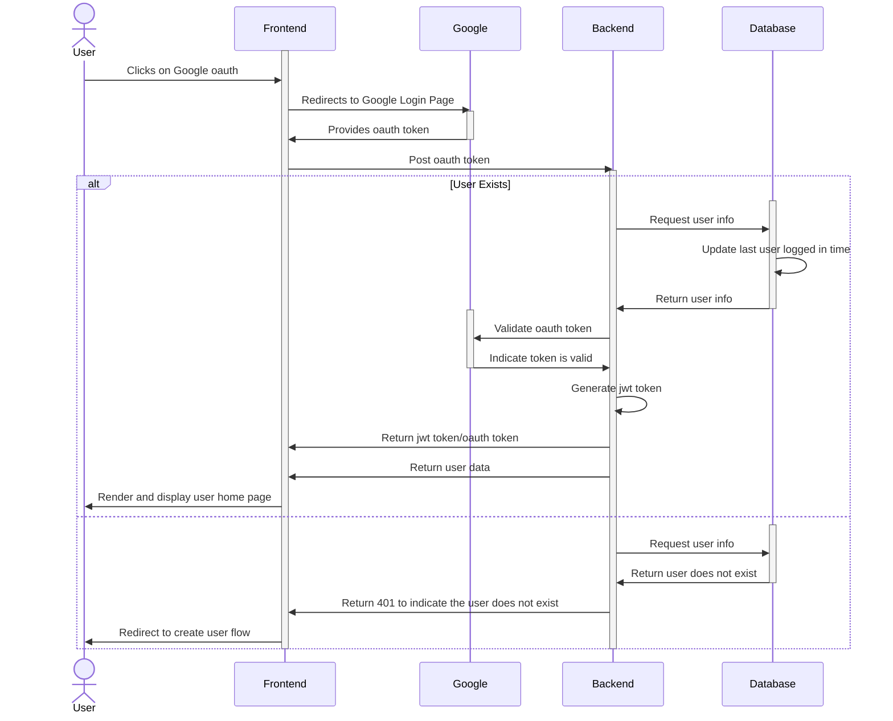

# FishSense Web App

## Create User Flow
TODO

## Login Flow

```mermaid
sequenceDiagram
    actor User

    activate Frontend
    
    User ->> Frontend: Clicks on Google oauth
    
    Frontend ->> Google: Redirects to Google Login Page
    activate Google
    Google ->> Frontend: Provides oauth token
    deactivate Google

    Frontend ->> Backend: Post oauth token
    activate Backend
    alt User Exists

    activate Database
    Backend ->> Database: Request user info
    Database ->> Database: Update last user logged in time
    Database ->> Backend: Return user info
    deactivate Database

    activate Google
    Backend ->> Google: Validate oauth token
    Google ->> Backend: Indicate token is valid
    deactivate Google
    Backend ->> Backend: Generate jwt token
    Backend ->> Frontend: Return jwt token/oauth token
    Backend ->> Frontend: Return user data
    Frontend ->> User: Render and display user home page

    else

    activate Database
    Backend ->> Database: Request user info
    Database ->> Backend: Return user does not exist
    deactivate Database
    Backend ->> Frontend: Return 401 to indicate the user does not exist
    Frontend ->> User: Redirect to create user flow

    end

    deactivate Backend
    deactivate Frontend
```