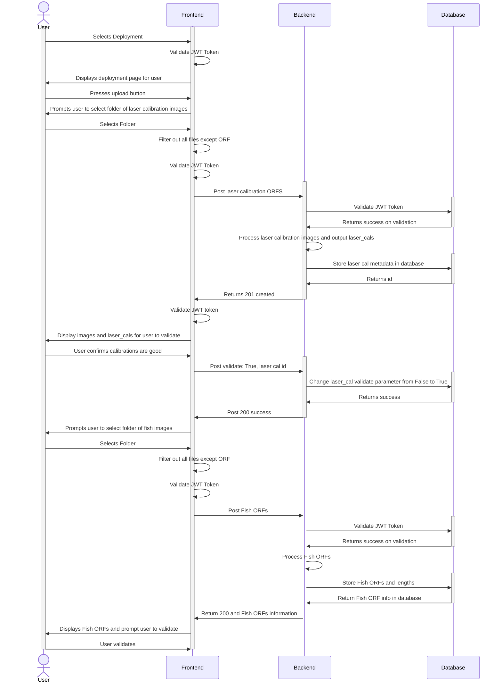

## Upload Files

## V1 1/28/2025

(Frame index is always 1 for non videos )

Asumptions:
Logged in, have deployment ready beforeha d

laser calibration images = (checkerboard or dive slate)

validate jwt token on route changes

backend jwt validation checks with database

laser and lens cal are bunch of matrices

let user validate laser detections

validate fish ORF instead of labeling

ask for dive slate pdf and checkerboard specifications

lens cal will be attached to camera and different flow

done by admin of org? camera associated with org?

POST camera / deployement info?

