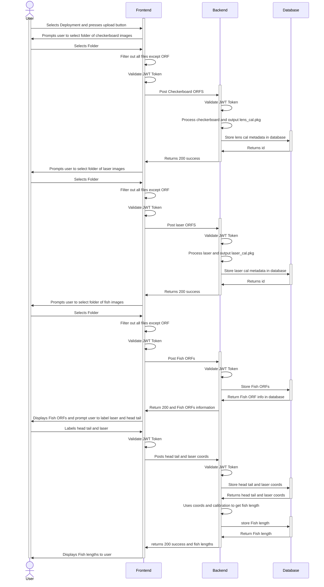

## Upload Files

## V1 1/28/2025

(have to have deployment ready beforehand)
(Frame index is always 1 for non videos )

```mermaid
sequenceDiagram
    actor User

    activate User
    activate Frontend
    
    User ->> Frontend: Selects Deployment and presses upload button
    Frontend ->> User: Prompts user to select folder of checkerboard images

    User ->> Frontend: Selects Folder

    Frontend ->> Frontend: Filter out all files except ORF

    Frontend ->> Frontend: Validate JWT Token

    activate Backend

    Frontend ->> Backend: Post Checkerboard ORFS

    Backend ->> Backend: Validate JWT Token

    Backend ->> Backend: Process checkerboard and output lens_cal.pkg

    activate Database

    Backend ->> Database: Store lens cal metadata in database

    Database ->> Backend: Returns id

    deactivate Database

    Backend ->> Frontend: Returns 200 success

    deactivate Backend

    Frontend ->> User: Prompts user to select folder of laser images

    User ->> Frontend: Selects Folder

    Frontend ->> Frontend: Filter out all files except ORF    

    Frontend ->> Frontend: Validate JWT Token

    activate Backend

    Frontend ->> Backend: Post laser ORFS

    Backend ->> Backend: Validate JWT Token

    Backend ->> Backend: Process laser and output laser_cal.pkg

    activate Database

    Backend ->> Database: Store laser cal metadata in database

    Database ->> Backend: Returns id

    deactivate Database

    Backend ->> Frontend: Returns 200 success

    deactivate Backend

    Frontend ->> User: Prompts user to select folder of fish images

    User ->> Frontend: Selects Folder

    Frontend ->> Frontend: Filter out all files except ORF

    Frontend ->> Frontend: Validate JWT Token

    activate Backend

    Frontend ->> Backend: Post Fish ORFs

    Backend ->> Backend: Validate JWT Token

    activate Database

    Backend ->> Database: Store Fish ORFs

    Database ->> Backend: Return Fish ORF info in database

    deactivate Database

    Backend ->> Frontend: Return 200 and Fish ORFs information

    Frontend ->> User: Displays Fish ORFs and prompt user to label laser and head tail

    User ->> Frontend: Labels head tail and laser

    Frontend ->> Frontend: Validate JWT Token

    Frontend ->> Backend: Posts head tail and laser coords

    Backend ->> Backend: Validate JWT Token

    activate Database

    Backend ->> Database: Store head tail and laser coords

    Database ->> Backend: Returns head tail and laser coords

    deactivate Database

    Backend ->> Backend: Uses coords and calibration to get fish length

    activate Database

    Backend ->> Database: store Fish length
    Database ->> Backend: Return Fish length

    deactivate Database

    Backend ->> Frontend: returns 200 success and fish lengths


    deactivate Backend

    Frontend ->> User: Displays Fish lengths to user


 

    deactivate Frontend
    deactivate User
```
